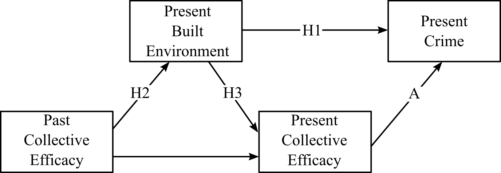
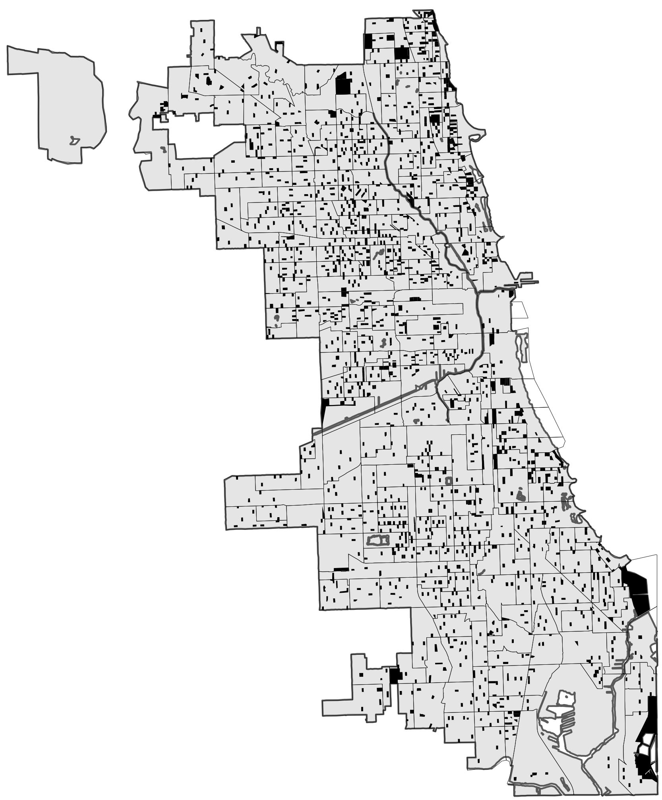
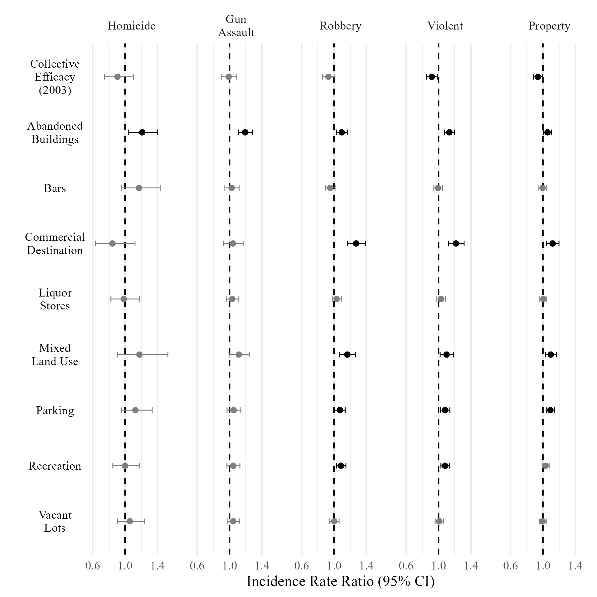

```{r, include=FALSE}
# This script pretty much does nothing--it just prints the graphics to a doc at the appropriate sizes.
library(tidyverse)
library(officedown)
```

\newpage

```{r basicmodel, echo=FALSE, fig.width = 4, fig.height = 4/2.891, fig.scap= "Theoretical model of collective efficacy, the built environment, and crime.",fig.cap="Theoretical model of collective efficacy, the built environment, and crime. Tested hypotheses represented as paths H1, H2, and H3"}
# Figure 1
# 1376 x 476; 2.891 WtH

```

\newpage


```{r blocksample, fig.width = 6*0.828, fig.height = 6, echo=FALSE, fig.scap="Map of census blocks sampled in 2001-2003 Chicago Community Adult Health Study.",  fig.cap="Map of census blocks sampled in 2001-2003 Chicago Community Adult Health Study. Sampled blocks are filled black shapes. Neighborhood clusters are outlines"}
# Figure 2
# 1666 x 2011; 0.828 WtH

```


\newpage

```{r longmodels, echo=FALSE, fig.width = 4, fig.height = 4/2.891,  fig.scap= "Longitudinal structural model.", fig.cap="Longitudinal structural model. Dashed arrow represents tested independence restriction (d-separation)"}
# Figure 3
# 1376 x 476; 2.891 WtH

```

\newpage

```{r directmodels, echo=FALSE, fig.width = 4, fig.height = 4/2.891, fig.scap = "Simplified depiction of crime models.", fig.cap="Simplified depiction of crime models. Solid arrows are modeled direct effects. The dashed arrow represents unmodeled (restricted) paths"}
# Figure 4
# 1376 x 476; 2.891 WtH

```

\newpage

```{r cebemodel, echo=FALSE, fig.width = 0.742*4, fig.height = 4/2.891, fig.cap="Models of the built environment and present collective efficacy"}
# Figure 5
# 1021 x 476; 2.891 WtH

```

\newpage

```{r coefplot, echo=FALSE, fig.width = 6, fig.height = 6,  fig.scap = "Estimated incidence rate ratios and 95% confidence intervals for selected predictors of five crime types.", fig.cap="Estimated incidence rate ratios and 95% confidence intervals for selected predictors of five crime types. Predictors are standardized, outcomes are log-counts. Estimates significant at p < .05 are in black. N = 1641"}
# Figure 6
# Square

```
